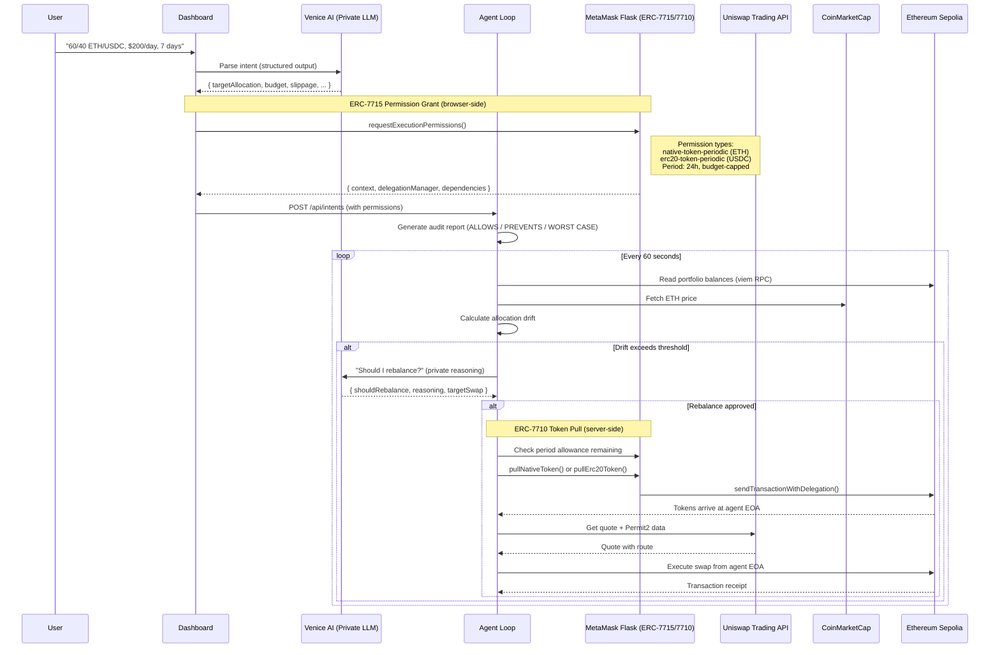
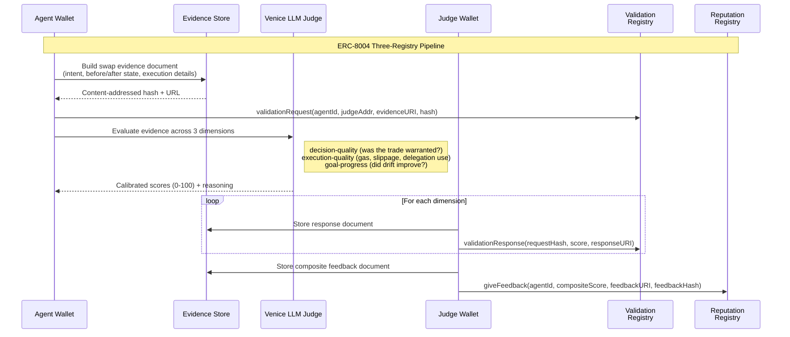

# Maw — Intent-Compiled Private DeFi Agent

A fully autonomous DeFi agent that reasons over sensitive portfolio data privately, produces trustworthy outputs for public on-chain systems, and executes trades within scoped spending permissions the human defines once — with every decision auditable and every action receipted on-chain.

**Synthesis Hackathon 2026** | Built by [neilei](https://github.com/neilei)

---

## What Is Maw?

DeFi users who want autonomous portfolio management face a dilemma: either trust an agent with full wallet access, or micromanage every trade. Every time an agent calls an API or executes a swap, it creates metadata — spending patterns, risk tolerance, portfolio value. The agent isn't leaking its own data; it's leaking yours.

Maw resolves this by compiling a natural language intent — like *"60/40 ETH/USDC, $200/day, 7 days"* — into granular, scoped permissions that the agent **cannot violate**, even if compromised. The human defines boundaries (amount limits, time windows, token-specific allowances) and the agent operates freely within them on-chain — without repeated user signatures.

The agent reasons privately about *when* to trade (Venice AI with no data retention and encrypted agent-to-service communication), but its *ability* to trade is constrained by on-chain periodic-transfer enforcers. Every swap is logged. Every decision is scored by an independent LLM judge. Every score is recorded on-chain in an ERC-8004 reputation registry with content-addressed evidence — proof of work performed and results delivered that lives on-chain, not inside a platform's internal logs.

The result: the human stays in control. A fully autonomous trading agent with scoped spending permissions, an auditable transaction history the human can inspect exactly, and a portable agent identity tied to Ethereum that no platform can delist.

---

## How It Works

### Intent Lifecycle



### Post-Swap Evaluation

After every successful swap, an independent judge pipeline evaluates the agent's performance and records the results on-chain:



The separation of agent wallet (requests validation) and judge wallet (submits scores) ensures the agent cannot rate itself. Evidence documents are content-addressed with keccak256 — the on-chain hash must match the hosted JSON, making tampering detectable.

---

## Architecture

```
packages/common/             Shared types, Zod schemas, constants, utilities (@maw/common)
packages/agent/              Backend — autonomous agent + HTTP API server
  src/
  ├── index.ts               CLI entrypoint
  ├── server.ts              HTTP API server (Hono, port 3147) — serves dashboard + JSON API
  ├── startup.ts             Server startup, active intent resumption
  ├── agent-loop/            Core autonomous loop — orchestrates all modules
  │   ├── index.ts           Loop orchestrator, drift calculation, cycle runner
  │   ├── market-data.ts     Market data gathering (prices, balances, pools)
  │   └── swap.ts            Two-step pull+swap execution with safety checks
  ├── agent-worker.ts        Per-intent worker (AbortController lifecycle, DB persistence)
  ├── worker-pool.ts         Concurrent worker management (max 5 intents)
  ├── config.ts              Env validation (Zod), contract addresses, chain config
  ├── db/                    SQLite persistence (drizzle-orm + better-sqlite3)
  │   ├── schema.ts          intents, swaps, auth_nonces, agentLogs tables
  │   ├── repository.ts      Data access layer
  │   └── connection.ts      DB connection with WAL mode
  ├── routes/                API route handlers
  │   ├── auth.ts            Nonce-signing wallet authentication (HMAC tokens)
  │   ├── intents.ts         Intent CRUD + log download + SSE stream
  │   ├── parse.ts           Venice LLM intent parsing endpoint
  │   └── identity.ts        ERC-8004 identity JSON endpoint
  ├── middleware/
  │   └── auth.ts            Bearer token / cookie auth middleware
  ├── venice/                VENICE AI — Private Reasoning
  │   ├── llm.ts             2 models, 3 LLM tiers (fast/research/reasoning) via LangChain
  │   ├── schemas.ts         Zod schemas for structured output
  │   └── image.ts           Per-agent avatar generation (LLM prompt → Venice image API)
  ├── delegation/            METAMASK DELEGATION — On-Chain Cage
  │   ├── compiler.ts        Intent text → structured IntentParse via Venice LLM
  │   ├── audit.ts           Human-readable audit report generation
  │   ├── redeemer.ts        ERC-7710 token pull (pullNativeToken / pullErc20Token)
  │   └── allowance.ts       On-chain period allowance queries via caveat enforcers
  ├── uniswap/               UNISWAP — Trade Execution
  │   ├── trading.ts         Quote + swap via Uniswap Trading API
  │   ├── permit2.ts         EIP-712 typed data signing for Permit2
  │   └── schemas.ts         Zod validation for API responses
  ├── data/                  Market data layer
  │   ├── prices.ts          Token prices via CoinMarketCap API (60s cache)
  │   ├── portfolio.ts       On-chain balances via viem RPC
  │   └── thegraph.ts        Uniswap V3 pool data via The Graph subgraph
  ├── identity/              PROTOCOL LABS — Agent Identity + Reputation
  │   ├── erc8004.ts         ERC-8004 three-registry functions (Identity, Reputation, Validation)
  │   ├── judge.ts           Venice LLM judge — evaluates swap quality
  │   ├── evidence.ts        Content-addressed JSON with keccak256 hashing
  │   └── dimensions.ts      Extensible scoring dimensions (configurable weights)
  ├── logging/               Observability
  │   ├── logger.ts          Pino logger instance
  │   ├── agent-log.ts       Global JSONL structured logging
  │   ├── intent-log.ts      Per-intent JSONL logs (downloadable via API, SSE streaming)
  │   ├── budget.ts          Venice compute budget tracking + model tier selection
  │   └── redact.ts          Log redaction for public-facing endpoints
  └── utils/
      └── retry.ts           Exponential backoff retry utility
apps/dashboard/              Next.js 16 dashboard (Configure, Audit, Monitor)
  app/                       App router pages + API routes
  components/                25 React components + UI primitives
  hooks/                     9 custom hooks (auth, permissions, intent feed, etc.)
  lib/                       Utility modules (API client, feed grouping, etc.)
  tests/                     Playwright e2e + integration tests
docs/                        Design docs, plans, research
agent.json                   PAM spec manifest — capabilities, tools, security policies
```

---

## Sponsor Integrations

Maw's design is built around the cross-integration of four sponsor technologies. A single intent flows through all four in sequence: Venice parses it, MetaMask constrains it, Uniswap executes it, and Protocol Labs records it.

### Venice AI — "Private Agents, Trusted Actions" ($11.5K)

Venice provides the agent's intelligence layer with a critical guarantee: **no data retention** and **encrypted agent-to-service communication**. Every LLM call is stateless — no session aggregation, no cross-request correlation, no training on queries. The agent reasons over sensitive data privately, producing trustworthy outputs for public on-chain systems.

This matters because DeFi agent reasoning is uniquely confidential. Over a 7-day trading window, Maw is a private treasury copilot making thousands of LLM calls. Each individually is benign; together they paint a complete picture of a trader's risk tolerance, reaction patterns, and portfolio value. Venice ensures these reasoning traces exist only in the agent's local logs — while the validated outputs (intent parameters, swap decisions, quality scores) feed directly into on-chain delegation constraints, Uniswap trades, and ERC-8004 reputation records. Human-controlled disclosure: the strategy stays private, only the execution receipts go on-chain.

**How Maw uses Venice** (implementation: [`venice/llm.ts`](packages/agent/src/venice/llm.ts), [`venice/schemas.ts`](packages/agent/src/venice/schemas.ts)):

| Capability | Integration | Details |
|---|---|---|
| **Multi-model routing** | 2 models, 3 LLM tiers via single API | `qwen3-5-9b` (fast checks + research with web search), `gemini-3-flash-preview` (reasoning) — auto-downgrades when Venice balance is low |
| **Web search + scraping** | Research tier with real-time data | Research tier enables `enable_web_search: "on"` + `enable_web_scraping: true` with citations; used for market analysis context |
| **Structured output** | Intent parsing, rebalance decisions, judge scoring | `.withStructuredOutput(zodSchema)` with `safeParse()` post-validation on every call |
| **Privacy guarantees** | No-retention inference | `include_venice_system_prompt: false`, `enable_e2ee: true`, prompt caching per tier |
| **Budget tracking** | Compute cost awareness | Custom fetch wrapper in [`logging/budget.ts`](packages/agent/src/logging/budget.ts) captures `x-venice-balance-usd` header; agent switches to cheaper models automatically |
| **LLM-as-judge** | Swap quality evaluation | Venice reasoning model in [`identity/judge.ts`](packages/agent/src/identity/judge.ts) scores each swap across 3 dimensions for ERC-8004 reputation |
| **Image generation** | Per-agent avatar | Two-step in [`venice/image.ts`](packages/agent/src/venice/image.ts): LLM generates creative prompt → Venice image API (`nano-banana-2`) renders unique agent avatar, served at `/api/intents/:id/avatar.webp` |

### MetaMask — "Best Use of Delegations" ($5K)

Delegations are not a feature of Maw — **intent-based delegations are the core pattern**. The human defines granular, scoped permissions once via MetaMask Flask, and the agent operates freely within them on-chain without repeated user signatures. Periodic-transfer caveat enforcers limit every pull to a per-period budget; the agent cannot escape its on-chain cage even if compromised.

This is a novel, creative use of delegations: natural language → LLM parsing → scoped ERC-7715 permissions → autonomous ERC-7710 execution, with pre-pull on-chain allowance verification and human-readable audit reports showing exactly what the agent can and cannot do.

**How the delegation pipeline works:**

1. **Intent compilation** — Venice LLM parses "60/40 ETH/USDC, $200/day, 7 days" into structured parameters (target allocation, budget, slippage, time window) via [compiler.ts](packages/agent/src/delegation/compiler.ts)
2. **ERC-7715 permission grant (browser-side)** — Dashboard extends the wallet client with `erc7715ProviderActions()` from `@metamask/smart-accounts-kit`. Calls `requestExecutionPermissions()` in MetaMask Flask with `native-token-periodic` (ETH) and `erc20-token-periodic` (USDC) permission types. Period: 24 hours. Amount: daily budget converted via conservative ETH pricing. Returns `{ context, delegationManager, dependencies }`. See [use-permissions.ts](apps/dashboard/hooks/use-permissions.ts).
3. **Allowance checking** — Before each pull, the agent queries remaining period budget on-chain via `createCaveatEnforcerClient()` + `decodeDelegations()`. Methods: `getNativeTokenPeriodTransferEnforcerAvailableAmount()` and `getErc20PeriodTransferEnforcerAvailableAmount()`. See [allowance.ts](packages/agent/src/delegation/allowance.ts).
4. **ERC-7710 token pull (server-side)** — Agent uses `erc7710WalletActions()` to call `sendTransactionWithDelegation()`, pulling tokens from the user's smart account to the agent EOA. See [redeemer.ts](packages/agent/src/delegation/redeemer.ts).
5. **Direct swap** — Agent swaps from its own EOA on Uniswap. The pull+swap separation exists because `native-token-periodic` includes an `ExactCalldataEnforcer("0x")` that restricts delegated calls to plain ETH transfers only.
6. **Audit report** — Before execution begins, the system generates a human-readable report: what the agent is ALLOWED to do, what it's PREVENTED from doing, the WORST CASE scenario, and any WARNINGS. See [audit.ts](packages/agent/src/delegation/audit.ts).

**On-chain delegation proof** (Ethereum Sepolia): [`0x725ba290...`](https://sepolia.etherscan.io/tx/0x725ba2904c3cd1b902fc656f201ef4786af84df56d8dc996a5cbb666b622f573) — delegation redemption via DelegationManager with caveat enforcement verified.

### Uniswap — "Agentic Finance" ($5K)

Uniswap is Maw's agentic finance execution layer — real Dev Platform API key, real TxIDs on Sepolia, deeper stack usage with Permit2 and The Graph. The agent autonomously quotes, signs, and executes swaps with no human in the loop.

**Integration points:**

| Component | What It Does | Code |
|---|---|---|
| **Trading API (quote)** | Fetches optimal swap routes with configurable slippage; forces V3 routing on Sepolia | `getQuote()` in [uniswap/trading.ts](packages/agent/src/uniswap/trading.ts) |
| **Trading API (swap)** | Creates executable swap transactions | `createSwap()` in [uniswap/trading.ts](packages/agent/src/uniswap/trading.ts) |
| **Permit2** | EIP-712 typed data signing for gasless ERC-20 approvals | `signPermit2Data()` in [uniswap/permit2.ts](packages/agent/src/uniswap/permit2.ts) |
| **Approval check** | Queries whether Permit2 allowance exists before each swap | `checkApproval()` in [uniswap/trading.ts](packages/agent/src/uniswap/trading.ts) |
| **The Graph** | Fetches top WETH/USDC Uniswap V3 pools by TVL — fed into LLM reasoning prompt with liquidity guidance | `getPoolData()` in [data/thegraph.ts](packages/agent/src/data/thegraph.ts) |

The agent uses The Graph pool data to make liquidity-aware decisions. When the reasoning LLM considers a rebalance, it sees TVL, 24h volume, and fee tiers for the top pools, with explicit guidance about when swap size relative to pool TVL suggests splitting across cycles.

**Real swap TxIDs on Ethereum Sepolia:**

| TX Hash | Trade | Amount |
|---------|-------|--------|
| [`0x9c2f1064...`](https://sepolia.etherscan.io/tx/0x9c2f1064c3e8affa46877a79a29ee7b2de25709b84ae275241662b76e9832f9b) | ETH → USDC | 0.0048 ETH |
| [`0x8c72a20e...`](https://sepolia.etherscan.io/tx/0x8c72a20e36595b76ded652b2577b39ca3a16a8fa1222264cd7097b4c15bdacb0) | ETH → USDC | 0.01 ETH |
| [`0x64e884db...`](https://sepolia.etherscan.io/tx/0x64e884db59603b129468553b08cb3fa9c1434fe159a635b9527c46e1befeab7d) | USDC → ETH (Permit2 flow) | Permit2 signing confirmed |

### Protocol Labs — "Let the Agent Cook" + "Agents With Receipts" ($16K)

Protocol Labs' ERC-8004 gives Maw a portable agent identity tied to Ethereum, on-chain attestations and composable reputation scores, and verifiable service quality — proof of work performed and results delivered that lives on-chain, not inside a platform's internal logs. The agent is fully autonomous: it discovers market conditions, plans rebalance strategies, executes trades, verifies results via LLM judge, and submits on-chain receipts — with self-correction when execution fails. Every transaction is viewable on block explorer.

**Three-registry architecture on Base Sepolia** (implementation: [`identity/erc8004.ts`](packages/agent/src/identity/erc8004.ts)):

| Registry | Purpose | Wallet | Code |
|---|---|---|---|
| **[Identity Registry](https://sepolia.basescan.org/address/0x8004A818BFB912233c491871b3d84c89A494BD9e)** | Per-intent NFT registration. Each intent gets its own `agentId`, persisted in SQLite across restarts. | Agent wallet | `registerAgent()` |
| **[Validation Registry](https://sepolia.basescan.org/address/0x8004Cb1BF31DAf7788923b405b754f57acEB4272)** | Per-swap evidence chain. Agent submits a `validationRequest` with content-addressed evidence; judge wallet responds with scores per dimension. | Agent (request), Judge (responses) | `submitValidationRequest()`, `submitValidationResponse()` |
| **[Reputation Registry](https://sepolia.basescan.org/address/0x8004B663056A597Dffe9eCcC1965A193B7388713)** | Composite swap quality score. `giveFeedback` with a weighted 0-10 score, linked to a content-addressed feedback document. | Judge wallet | `giveFeedback()` |

**Scoring dimensions** (implementation: [`identity/dimensions.ts`](packages/agent/src/identity/dimensions.ts), extensible per intent type):

- **Decision quality** (weight 0.4) — Was the rebalance warranted? Was the trade size appropriate given drift and budget?
- **Execution quality** (weight 0.3) — Gas efficiency, slippage, delegation usage (preferred over direct tx)
- **Goal progress** (weight 0.3) — Did the swap move the portfolio closer to the target allocation?

**Venice LLM judge** ([`identity/judge.ts`](packages/agent/src/identity/judge.ts)) — After each swap, `evaluateSwap()` orchestrates the full pipeline: build evidence → store content-addressed JSON → submit on-chain validation request (agent wallet) → LLM scores across 3 dimensions → submit 3 on-chain validation responses (judge wallet) → compute weighted composite → submit on-chain reputation feedback (judge wallet). Separate judge wallet ensures the agent cannot rate itself.

**Evidence system** ([`identity/evidence.ts`](packages/agent/src/identity/evidence.ts)) — Content-addressed JSON hosted at `https://api.maw.finance/api/evidence/{intentId}/{hash}`. The on-chain keccak256 hash must match the hosted content, making post-hoc tampering detectable. Evidence documents include before/after portfolio state, execution details, and agent reasoning.

**On-chain proof** (Base Sepolia):

| Type | TX Hash |
|------|---------|
| ERC-8004 identity registration | [`0x97237b74...`](https://sepolia.basescan.org/tx/0x97237b74dfc3e4c332eed65b79aa9d73664a7afc1090ec9456a45a0dcfce829e) |
| ERC-8004 reputation feedback | [`0x4db757c8...`](https://sepolia.basescan.org/tx/0x4db757c8d7e02e1ae3f1762cea2d1ed9c623161581b41b611651aa1a452523e8) |
| Synthesis registration (Base Mainnet) | [`0x7452f62b...`](https://basescan.org/tx/0x7452f62bdc98f215ee2d79fc19d587a3c2696fb0e53089e116ae973bacd78bc3) |

**Additional Protocol Labs integrations:**

- **[agent.json](agent.json)** — PAM spec manifest (DevSpot-compatible) declaring agent name, operator wallet, ERC-8004 identity, capabilities, tools, tech stacks, compute constraints, and security policies
- **Structured execution logs** — Global `agent_log.jsonl` ([`logging/agent-log.ts`](packages/agent/src/logging/agent-log.ts)) with decisions, tool calls, cycle results, errors + per-intent `data/logs/{intentId}.jsonl` ([`logging/intent-log.ts`](packages/agent/src/logging/intent-log.ts)), downloadable via `GET /api/intents/:id/logs`
- **Safety guardrails** — Budget guard, trade limit guard, per-trade max, delegation allowance pre-check, adversarial intent detection — all checked before every irreversible swap action
- **Compute budget awareness** — Venice balance tracked via `x-venice-balance-usd` header; agent auto-downgrades model tier (normal → conservation → critical) to stay within budget

---

## Live Demo

- **Dashboard**: [https://maw.finance](https://maw.finance)
- **API**: [https://api.maw.finance](https://api.maw.finance)

---

## Setup

```bash
# Clone
git clone https://github.com/neilei/synthesis-hackathon.git
cd synthesis-hackathon

# Install (pnpm workspaces)
pnpm install

# Configure
cp .env.example .env
# Required: VENICE_API_KEY, UNISWAP_API_KEY, AGENT_PRIVATE_KEY
# Optional: CMC_PRO_API_KEY, JUDGE_PRIVATE_KEY, THEGRAPH_API_KEY

# Test
pnpm test             # unit tests (agent + common + dashboard)
pnpm run test:e2e     # e2e tests (needs API keys)

# Run API server + dashboard
pnpm run serve        # http://localhost:3147

# Run agent (CLI mode)
pnpm run dev -- --intent "60/40 ETH/USDC, \$200/day, 7 days"

# Dashboard dev server (hot reload)
pnpm run dev:dashboard
```

---

## Tech Stack

- **Runtime**: Node.js 22, TypeScript 5.8, pnpm workspaces + turborepo
- **AI**: Venice AI (OpenAI-compatible) via LangChain (`@langchain/openai`)
- **Chain**: viem 2.x, Ethereum Sepolia / Base Sepolia / Base Mainnet
- **Delegation**: `@metamask/smart-accounts-kit@0.4.0-beta.1` (ERC-7715 + ERC-7710)
- **DEX**: Uniswap Trading API + Permit2 (EIP-712)
- **Data**: CoinMarketCap API (prices), The Graph (Uniswap V3 subgraph), Venice web search (market context)
- **Identity**: ERC-8004 Identity + Reputation + Validation Registries on Base Sepolia
- **Persistence**: SQLite (drizzle-orm + better-sqlite3, WAL mode)
- **HTTP**: Hono framework
- **Validation**: Zod schemas throughout (`@maw/common`)
- **Testing**: Vitest (unit + e2e), Playwright (dashboard e2e + integration)
- **Dashboard**: Next.js 16, wagmi v3, React 19, tailwindcss

---

## Verification Guide

A structured map of every sponsor integration claim, where to find the implementation, how to verify it, and the on-chain contracts involved. Designed for systematic verification.

**Test files:** 57 in `packages/agent/`, 5 in `packages/common/`, 3 in `apps/dashboard/` (vitest), 15 in `apps/dashboard/tests/` (Playwright e2e + integration) — 80 test files total. Run `pnpm test` (unit) or `pnpm run test:e2e` (integration, requires API keys).

### On-Chain Contracts

| Contract | Chain | Address | Explorer |
|----------|-------|---------|----------|
| ERC-8004 Identity Registry | Base Sepolia | `0x8004A818BFB912233c491871b3d84c89A494BD9e` | [basescan](https://sepolia.basescan.org/address/0x8004A818BFB912233c491871b3d84c89A494BD9e) |
| ERC-8004 Reputation Registry | Base Sepolia | `0x8004B663056A597Dffe9eCcC1965A193B7388713` | [basescan](https://sepolia.basescan.org/address/0x8004B663056A597Dffe9eCcC1965A193B7388713) |
| ERC-8004 Validation Registry | Base Sepolia | `0x8004Cb1BF31DAf7788923b405b754f57acEB4272` | [basescan](https://sepolia.basescan.org/address/0x8004Cb1BF31DAf7788923b405b754f57acEB4272) |
| MetaMask DelegationManager | Eth Sepolia | `0xdb9B1e94B5b69Df7e401DDbedE43491141047dB3` | [etherscan](https://sepolia.etherscan.io/address/0xdb9B1e94B5b69Df7e401DDbedE43491141047dB3) |
| Uniswap Universal Router | Eth Sepolia | `0x3A9D48AB9751398BbFa63ad67599Bb04e4BdF98b` | [etherscan](https://sepolia.etherscan.io/address/0x3A9D48AB9751398BbFa63ad67599Bb04e4BdF98b) |
| Permit2 | Eth Sepolia | `0x000000000022D473030F116dDEE9F6B43aC78BA3` | [etherscan](https://sepolia.etherscan.io/address/0x000000000022D473030F116dDEE9F6B43aC78BA3) |

Agent wallet: [`0xf13021F02E23a8113C1bD826575a1682F6Fac927`](https://sepolia.etherscan.io/address/0xf13021F02E23a8113C1bD826575a1682F6Fac927) — check transaction history for swap and delegation activity.

### Sponsor Verification Map

Each row links a sponsor prize claim to the implementation file, the test that proves it works, and what to look for.

**Venice ($11.5K) — "Private Agents, Trusted Actions"**

| Claim | Implementation | Test | What to verify |
|-------|---------------|------|----------------|
| Private cognition over sensitive DeFi data (no data retention) | [venice/llm.ts](packages/agent/src/venice/llm.ts) | [llm.test.ts](packages/agent/src/venice/__tests__/llm.test.ts) | `include_venice_system_prompt: false`, `enable_e2ee: true` in `baseVeniceParams`; portfolio strategy never leaves the agent |
| Trustworthy outputs for public on-chain systems | [venice/schemas.ts](packages/agent/src/venice/schemas.ts) | [schemas.test.ts](packages/agent/src/venice/__tests__/schemas.test.ts) | `IntentParseSchema`, `RebalanceDecisionSchema`; `.withStructuredOutput()` + `safeParse()` — validated outputs drive on-chain delegation and swap execution |
| Multi-model routing via `venice_parameters` | [venice/llm.ts](packages/agent/src/venice/llm.ts) | [llm.test.ts](packages/agent/src/venice/__tests__/llm.test.ts), [llm.e2e.test.ts](packages/agent/src/venice/__tests__/llm.e2e.test.ts) | 2 models, 3 tiers: `qwen3-5-9b` (fast + research with web search), `gemini-3-flash-preview` (reasoning) — auto-downgrades when balance is low |
| Web search with citations + web scraping | [venice/llm.ts](packages/agent/src/venice/llm.ts) | [llm.e2e.test.ts](packages/agent/src/venice/__tests__/llm.e2e.test.ts) | Research tier: `enable_web_search: "on"`, `enable_web_scraping: true`, `enable_web_citations: true` — used for market context in reasoning |
| Compute budget awareness | [logging/budget.ts](packages/agent/src/logging/budget.ts) | [budget.test.ts](packages/agent/src/logging/__tests__/budget.test.ts) | Custom fetch wrapper captures `x-venice-balance-usd` header; auto-switches to cheaper model tier |
| Novel use: LLM-as-judge for on-chain reputation | [identity/judge.ts](packages/agent/src/identity/judge.ts) | [judge.test.ts](packages/agent/src/identity/__tests__/judge.test.ts) | Venice reasoning model evaluates each swap across 3 dimensions, scores feed into [Reputation Registry](https://sepolia.basescan.org/address/0x8004B663056A597Dffe9eCcC1965A193B7388713) |
| Image generation for agent identity | [venice/image.ts](packages/agent/src/venice/image.ts) | [image.test.ts](packages/agent/src/venice/__tests__/image.test.ts), [image.e2e.test.ts](packages/agent/src/venice/__tests__/image.e2e.test.ts) | LLM generates creative prompt → `nano-banana-2` renders avatar → served at `/api/intents/:id/avatar.webp` |

**MetaMask ($5K) — "Best Use of Delegations"**

| Claim | Implementation | Test | What to verify |
|-------|---------------|------|----------------|
| ERC-7715 permission grant (browser-side) | [hooks/use-permissions.ts](apps/dashboard/hooks/use-permissions.ts) | [permissions.spec.ts](apps/dashboard/tests/permissions.spec.ts) | `erc7715ProviderActions()` extends wallet client → `requestExecutionPermissions()` with `native-token-periodic` + `erc20-token-periodic` permission types; 24h period, budget-capped |
| Intent-based delegation as core pattern (NL → constraints) | [delegation/compiler.ts](packages/agent/src/delegation/compiler.ts) | [compiler.test.ts](packages/agent/src/delegation/__tests__/compiler.test.ts), [compiler.e2e.test.ts](packages/agent/src/delegation/__tests__/compiler.e2e.test.ts) | `compileIntent()` parses NL via Venice → structured `IntentParse` → browser converts to ERC-7715 permission parameters |
| Pre-pull allowance checking (on-chain caveat query) | [delegation/allowance.ts](packages/agent/src/delegation/allowance.ts) | [allowance.test.ts](packages/agent/src/delegation/__tests__/allowance.test.ts), [allowance.e2e.test.ts](packages/agent/src/delegation/__tests__/allowance.e2e.test.ts) | `createCaveatEnforcerClient()` + `decodeDelegations()` → `getNativeTokenPeriodTransferEnforcerAvailableAmount()` / `getErc20PeriodTransferEnforcerAvailableAmount()` — queries remaining budget before each pull |
| ERC-7710 token pull (server-side, no browser) | [delegation/redeemer.ts](packages/agent/src/delegation/redeemer.ts) | [redeemer.test.ts](packages/agent/src/delegation/__tests__/redeemer.test.ts), [redeemer.e2e.test.ts](packages/agent/src/delegation/__tests__/redeemer.e2e.test.ts) | `erc7710WalletActions()` → `sendTransactionWithDelegation()` with permission context from ERC-7715 grant — pulls tokens to agent EOA autonomously |
| Two-step pull+swap architecture | [agent-loop/swap.ts](packages/agent/src/agent-loop/swap.ts) | [swap-safety.test.ts](packages/agent/src/__tests__/swap-safety.test.ts) | Step 1: pull tokens via ERC-7710 delegation. Step 2: swap from agent EOA on Uniswap. Separation required because `ExactCalldataEnforcer("0x")` prevents contract calls via delegation |
| Novel: human-readable audit report before execution | [delegation/audit.ts](packages/agent/src/delegation/audit.ts) | [audit.test.ts](packages/agent/src/delegation/__tests__/audit.test.ts), [audit.e2e.test.ts](packages/agent/src/delegation/__tests__/audit.e2e.test.ts) | ALLOWS / PREVENTS / WORST CASE / WARNINGS — user sees exactly what agent can and cannot do before approving |
| Safety: adversarial intent detection | [delegation/compiler.ts](packages/agent/src/delegation/compiler.ts), [@maw/common](packages/common/src/delegation.ts) | [compiler.test.ts](packages/agent/src/delegation/__tests__/compiler.test.ts), [delegation.test.ts](packages/common/src/__tests__/delegation.test.ts) | `detectAdversarialIntent()` flags dangerous configs (budget > $1K, slippage > 2%, window > 30d) before delegation creation |

**Uniswap ($5K) — "Agentic Finance (Best Uniswap API Integration)"**

| Claim | Implementation | Test | What to verify |
|-------|---------------|------|----------------|
| Real Dev Platform API key + real TxIDs on Sepolia | [uniswap/trading.ts](packages/agent/src/uniswap/trading.ts) | [trading.test.ts](packages/agent/src/uniswap/__tests__/trading.test.ts), [trading.e2e.test.ts](packages/agent/src/uniswap/__tests__/trading.e2e.test.ts) | `getQuote()`, `createSwap()` with authenticated Uniswap Trading API (`x-api-key` header); real swaps visible in [agent wallet history](https://sepolia.etherscan.io/address/0xf13021F02E23a8113C1bD826575a1682F6Fac927) |
| Deeper stack: Permit2 (EIP-712 typed data signing) | [uniswap/permit2.ts](packages/agent/src/uniswap/permit2.ts) | [permit2.test.ts](packages/agent/src/uniswap/__tests__/permit2.test.ts), [permit2.e2e.test.ts](packages/agent/src/uniswap/__tests__/permit2.e2e.test.ts) | `signPermit2Data()` signs PermitSingle against [Permit2 contract](https://sepolia.etherscan.io/address/0x000000000022D473030F116dDEE9F6B43aC78BA3); full flow: approval check → quote → signature → swap |
| Deeper stack: The Graph subgraph integration | [data/thegraph.ts](packages/agent/src/data/thegraph.ts) | [thegraph.test.ts](packages/agent/src/data/__tests__/thegraph.test.ts), [thegraph.e2e.test.ts](packages/agent/src/data/__tests__/thegraph.e2e.test.ts) | `getPoolData()` queries Uniswap V3 subgraph (top WETH/USDC pools by TVL); pool data fed into LLM reasoning at [market-data.ts](packages/agent/src/agent-loop/market-data.ts) |
| Agentic finance: autonomous delegation-routed swaps | [agent-loop/swap.ts](packages/agent/src/agent-loop/swap.ts) | [agent-loop.test.ts](packages/agent/src/__tests__/agent-loop.test.ts) | Pull tokens via ERC-7710, then direct swap from agent EOA; fully autonomous with budget/trade/allowance safety checks |

**Protocol Labs ($16K) — "Let the Agent Cook" + "Agents With Receipts"**

*Bounty 1 ("Let the Agent Cook") checklist: autonomous execution, self-correction, ERC-8004 identity, agent.json, structured logs, real tool use, safety guardrails, compute budget awareness.*
*Bounty 2 ("Agents With Receipts") checklist: real on-chain txns with identity/reputation/validation registries, autonomous architecture, agent identity + operator model, on-chain verifiability, DevSpot-compatible agent.json + agent_log.json.*

| Claim | Implementation | Test | What to verify |
|-------|---------------|------|----------------|
| Autonomous execution with self-correction loop | [agent-loop/index.ts](packages/agent/src/agent-loop/index.ts) | [agent-loop.test.ts](packages/agent/src/__tests__/agent-loop.test.ts) | `runAgentLoop()` runs 60s cycles: gather data → calculate drift → reason → execute → log → repeat. Delegation fallback on failure = self-correction |
| ERC-8004 identity linked to operator wallet | [identity/erc8004.ts](packages/agent/src/identity/erc8004.ts) | [erc8004.test.ts](packages/agent/src/identity/__tests__/erc8004.test.ts), [erc8004.e2e.test.ts](packages/agent/src/identity/__tests__/erc8004.e2e.test.ts) | `registerAgent()` mints per-intent NFT on [Identity Registry](https://sepolia.basescan.org/address/0x8004A818BFB912233c491871b3d84c89A494BD9e); `agentId` persisted in SQLite |
| Real on-chain txns: identity/reputation/validation registries | [identity/erc8004.ts](packages/agent/src/identity/erc8004.ts) | [erc8004.test.ts](packages/agent/src/identity/__tests__/erc8004.test.ts) | `registerAgent()` → [Identity](https://sepolia.basescan.org/address/0x8004A818BFB912233c491871b3d84c89A494BD9e), `giveFeedback()` → [Reputation](https://sepolia.basescan.org/address/0x8004B663056A597Dffe9eCcC1965A193B7388713), `submitValidationRequest/Response()` → [Validation](https://sepolia.basescan.org/address/0x8004Cb1BF31DAf7788923b405b754f57acEB4272) |
| On-chain verifiability (block explorer) | [identity/evidence.ts](packages/agent/src/identity/evidence.ts) | [evidence.test.ts](packages/agent/src/identity/__tests__/evidence.test.ts) | Content-addressed JSON at `https://api.maw.finance/api/evidence/{intentId}/{hash}`; keccak256 hash on-chain matches hosted document |
| Agent capability manifest (`agent.json`) | [agent.json](agent.json) | — | 3 profiles (core/exec/gov), 6 tools, 3 capabilities, security policies — valid JSON Agents PAM spec |
| Structured execution logs (`agent_log.json`) | [logging/agent-log.ts](packages/agent/src/logging/agent-log.ts) | [agent-log.test.ts](packages/agent/src/logging/__tests__/agent-log.test.ts) | JSONL with decisions, tool calls, cycle results, errors; per-intent logs at `data/logs/{intentId}.jsonl` |
| Real tool use (Venice, Uniswap, The Graph, CoinMarketCap, viem) | [agent-loop/](packages/agent/src/agent-loop/) | [agent-loop.test.ts](packages/agent/src/__tests__/agent-loop.test.ts) | Each cycle calls: CoinMarketCap API (prices), viem RPC (balances), The Graph (pools), Venice reasoning (decisions), Uniswap Trading API (quotes/swaps) |
| Safety guardrails before irreversible actions | [agent-loop/swap.ts](packages/agent/src/agent-loop/swap.ts) | [swap-safety.test.ts](packages/agent/src/__tests__/swap-safety.test.ts) | Budget guard, trade limit guard, per-trade max, allowance pre-check, adversarial intent detection — all checked before every swap |
| Compute budget awareness | [logging/budget.ts](packages/agent/src/logging/budget.ts) | [budget.test.ts](packages/agent/src/logging/__tests__/budget.test.ts) | Venice balance tracked via `x-venice-balance-usd` header; auto-downgrades model tier when budget is low (normal → conservation → critical) |
| Venice LLM judge + 3-dimension validation | [identity/judge.ts](packages/agent/src/identity/judge.ts) | [judge.test.ts](packages/agent/src/identity/__tests__/judge.test.ts) | `evaluateSwap()` orchestrates: evidence → [Validation Registry](https://sepolia.basescan.org/address/0x8004Cb1BF31DAf7788923b405b754f57acEB4272) request → LLM scoring → 3x validation responses → [Reputation Registry](https://sepolia.basescan.org/address/0x8004B663056A597Dffe9eCcC1965A193B7388713) feedback |
| Per-intent downloadable logs | [logging/intent-log.ts](packages/agent/src/logging/intent-log.ts) | [intent-log.test.ts](packages/agent/src/logging/__tests__/intent-log.test.ts) | `IntentLogger` class; downloadable via `GET /api/intents/:id/logs`; SSE streaming via `GET /api/intents/:id/events` |

### API Endpoints (Live)

| Endpoint | Purpose | Auth |
|----------|---------|------|
| `GET /api/auth/nonce?wallet=0x...` | Get signing nonce | None |
| `POST /api/auth/verify` | Verify wallet signature, get bearer token | None |
| `POST /api/parse-intent` | Parse natural language intent via Venice LLM | None |
| `POST /api/intents` | Create new intent (with ERC-7715 permissions) | Bearer token |
| `GET /api/intents` | List intents for wallet | Bearer token |
| `GET /api/intents/:id` | Get intent detail + live agent state | Bearer token |
| `DELETE /api/intents/:id` | Cancel intent | Bearer token |
| `GET /api/intents/:id/events` | SSE stream of live log entries | Bearer token |
| `GET /api/intents/:id/logs` | Download per-intent JSONL log | Bearer token |
| `GET /api/intents/public` | List all active intents (no sensitive data) | None |
| `GET /api/intents/public/:id` | View single intent (redacted logs) | None |
| `GET /api/intents/public/:id/events` | SSE stream (redacted entries only) | None |
| `GET /api/intents/:id/identity.json` | Agent identity JSON (ERC-8004 agentURI) | None |
| `GET /api/intents/:id/avatar.webp` | Agent avatar image | None |
| `GET /api/evidence/:intentId/:hash` | Content-addressed evidence document (immutable) | None |

---

## Hackathon Themes

Maw solves a real problem, not a checklist. One intent flows through all four sponsor technologies in sequence: Venice parses it privately, MetaMask constrains it on-chain, Uniswap executes it, and Protocol Labs records it with verifiable receipts. The human stays in control — the agent is the tool.

- **Agents that keep secrets** — Every LLM call leaks metadata about the human — spending patterns, risk tolerance, portfolio value. Venice's no-data-retention inference with encrypted agent-to-service communication ensures the agent reasons over sensitive data privately, producing trustworthy outputs for public on-chain systems. Human-controlled disclosure: strategy stays private, only execution receipts go on-chain.
- **Agents that pay** — The human defines scoped spending permissions (amount limits, time windows, token-specific allowances) and the agent operates freely within them on-chain — without repeated user signatures. On-chain settlement: the agent pays via ERC-7710 delegation, the chain confirms, and both sides have proof. Auditable transaction history: the human can inspect exactly what the agent did with their money, on-chain, after the fact.
- **Agents that trust** — Portable agent credentials tied to Ethereum — no platform can delist the agent or cut off access. On-chain attestations and composable reputation scores via ERC-8004 three-registry pipeline. Verifiable service quality: proof of work performed and results delivered lives on-chain with content-addressed evidence, not inside a platform's internal logs.

---

## License

MIT
